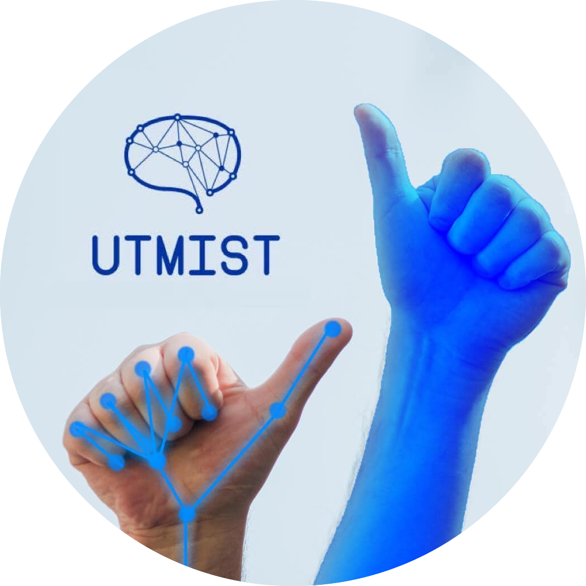

# UTMIST: Hand Gesture Recognition System 
======================

## Steps To Use:

1. Download best weights: https://drive.google.com/drive/folders/1t4JcH-Y5rIvTWbKiEQ-x2_5NsUg8mP_L?usp=sharing and copy the absolute path of where you placed this.

2. Install requirements.

3. Use: `python webcam.py -e False -u False -cp [insert absolute path of weights here]` to run inferences using your webcam. (If you have a GPU, use -u True) 

4. if you want to train, the paths in the config files will have to be changed so don't worry about modifying those. 

