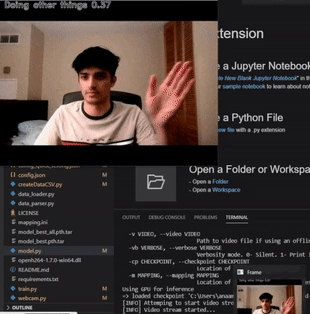
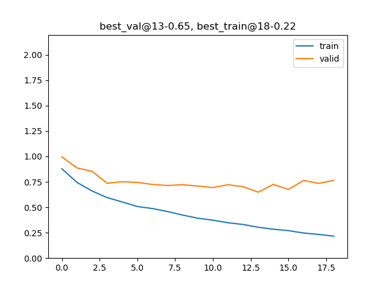

# Hand Gesture Recognition Research | UTMIST 👋 

## Introduction

The focus of this research project is on the development of a complex hand gesture recognition system that can interface with a website, games and a robot all using the built-in webcam of a computer. In this currently on going project, I am responsible for researching contemporary machine learning approaches to achieving this goal, find an appropriate dataset and developing a model and train it to have a high performance accuracy. I am conducting the research work and development with a group of dedicated students in the University Of Toronto Machine Intelligence Student Team. The Haar Cascades and SSD folders were made by my teammate [Charles Yuan](https://github.com/Chubbyman2).

## Results

Watch a presentation that describes the work we have done along with some results: https://www.youtube.com/watch?v=XAs5Ox2Dhe0.

The deep learning model architecture can be found in `model.py` file in the Gesture-Recognition-and-Control folder. The current model was training for 20 epochs on a GPU on the 20BN-JESTER dataset and has a best **training accuracy of 92.53%** and best **validation accuracy of 81.46%**. The graph shown is of the loss function and the demo shown depicts the **9 gesture classes** the model trained upon in action. Currently, the FPS averages 24 FPS on a GPU but needs improvement for CPU usage. 

     

## Steps To Use

1. Download best weights: https://drive.google.com/drive/folders/1t4JcH-Y5rIvTWbKiEQ-x2_5NsUg8mP_L?usp=sharing and copy the absolute path of where you placed this.

2. Install requirements.

3. Use: `python webcam.py -e False -u False -cp [insert absolute path of weights here]` to run inferences using your webcam. (If you have a GPU, use -u True) 

4. if you want to train, the paths in the config files will have to be changed so don't worry about modifying those. 
